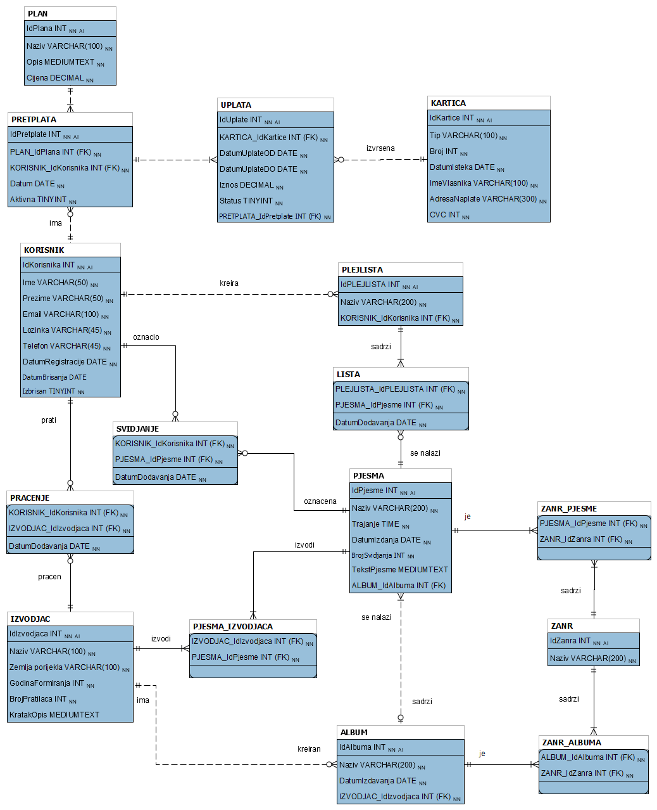

# Serenada - Music Streaming Database

 <!-- Use your schema image here -->

## Project Description

Serenada is a comprehensive database system designed for a music streaming application. It provides users with the ability to search, stream, and organize music content while supporting artist discovery, playlist creation, and personalized music experiences.

## Key Features

- **User Management**: Secure user accounts with authentication
- **Music Catalog**: Extensive database of songs, albums, and artists
- **Playlist Functionality**: Create and manage personal playlists
- **Social Features**: Follow artists and like songs
- **Subscription System**: Premium membership options with payment tracking

## Database Schema Overview

### Main Entities

1. **Users (KORISNIK)**
   - Stores user account information (name, email, password, etc.)
   - Tracks registration and deletion dates

2. **Artists (IZVODJAC)**
   - Contains artist details (name, origin country, formation year)
   - Includes follower count and description

3. **Songs (PJESMA)**
   - Stores song metadata (title, duration, release date)
   - Tracks likes and includes optional lyrics
   - Linked to albums and artists

4. **Albums (ALBUM)**
   - Organizes songs into collections
   - Contains release information and artist associations

5. **Playlists (PLEJLISTA)**
   - User-created song collections
   - Tracks creation dates and ownership

6. **Genres (ZANR)**
   - Categorizes music content
   - Applied to both songs and albums

### Relationship Features

- **Following Artists (PRACENJE)**: Users can follow their favorite artists
- **Liked Songs (SVIDJANJE)**: Users can mark songs as favorites
- **Playlist Contents (LISTA)**: Tracks which songs are in which playlists
- **Subscriptions (PRETPLATA)**: Manages premium user memberships

## Technical Specifications

- **Database System**: MySQL
- **Key Technologies**:
  - Stored procedures for complex operations
  - Foreign key constraints for data integrity
  - Views for simplified data access
- **Application Interface**: Windows Forms (C#) with MySQL Connector

## Business Rules

1. Users must have unique email addresses
2. Songs must belong to an album
3. Albums must have an associated artist
4. Playlists are owned by individual users
5. Subscription payments are linked to user accounts

## Setup Instructions

1. Import the database schema using the provided SQL scripts
2. Configure the connection string in `app.config`:
   ```xml
   <connectionStrings>
     <add name="serenada" connectionString="Server=your_server;Database=serenada_db;Uid=username;Pwd=password;"/>
   </connectionStrings>
